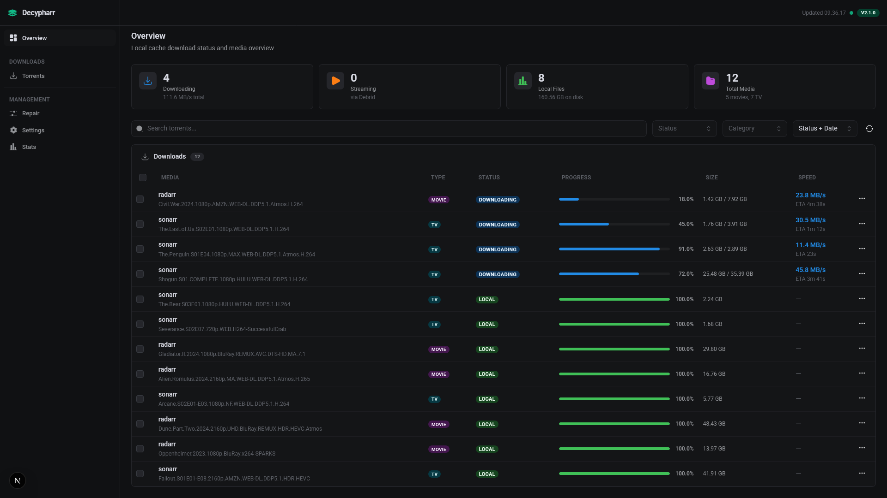
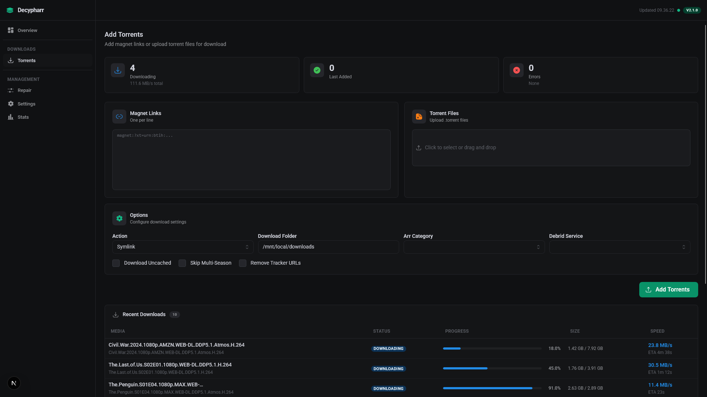
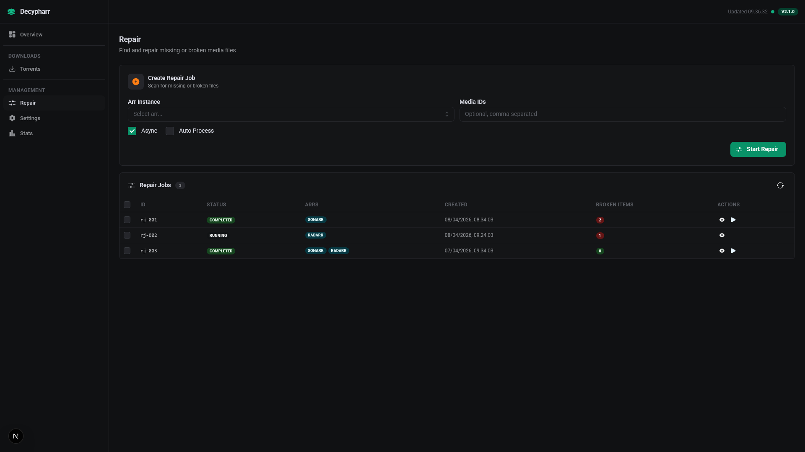
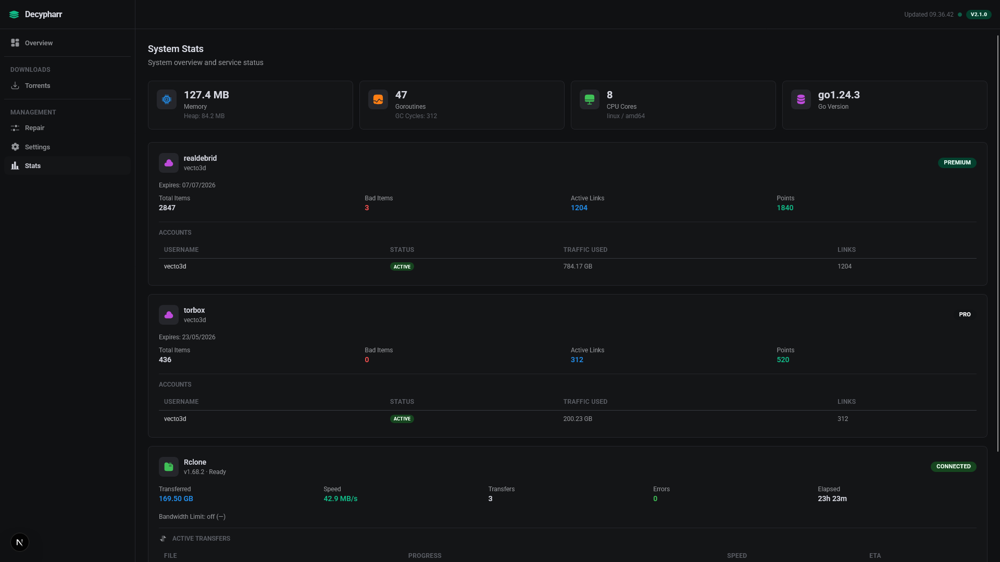
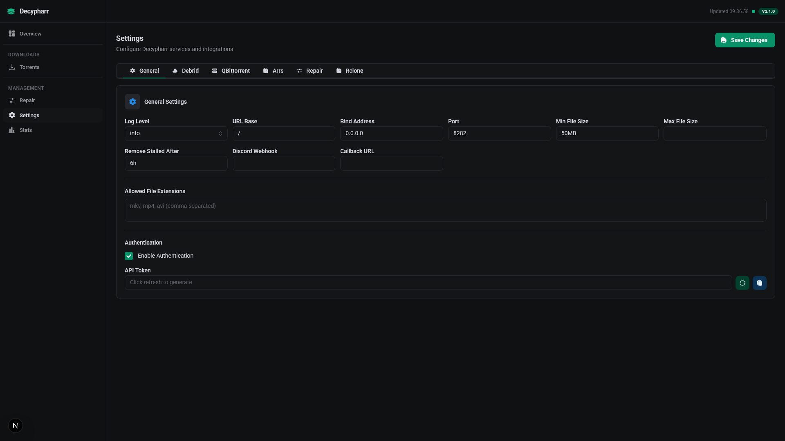
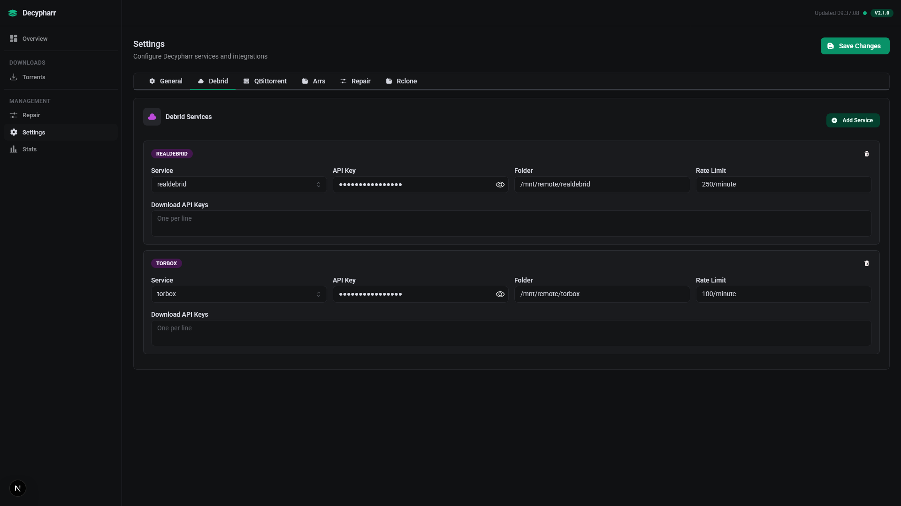
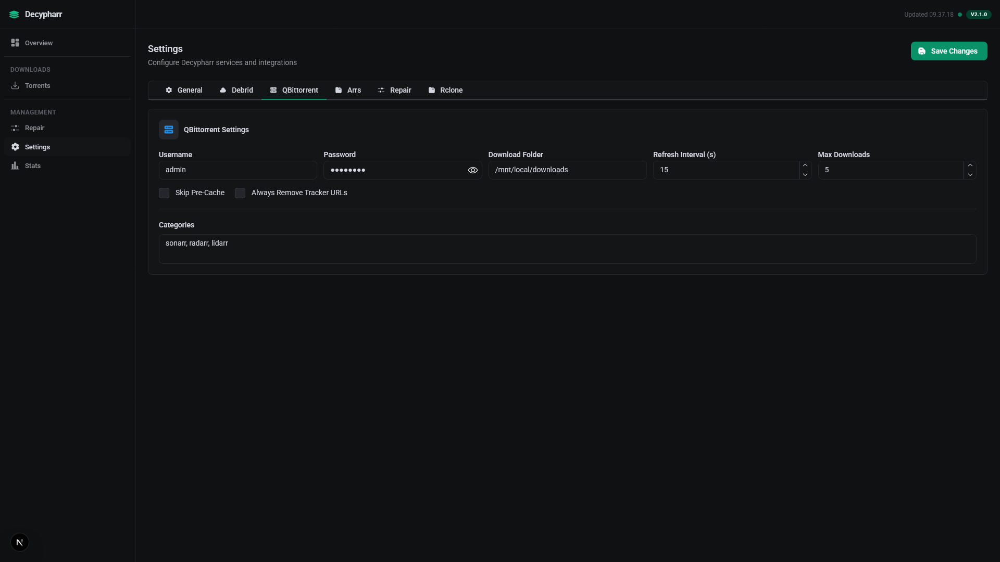
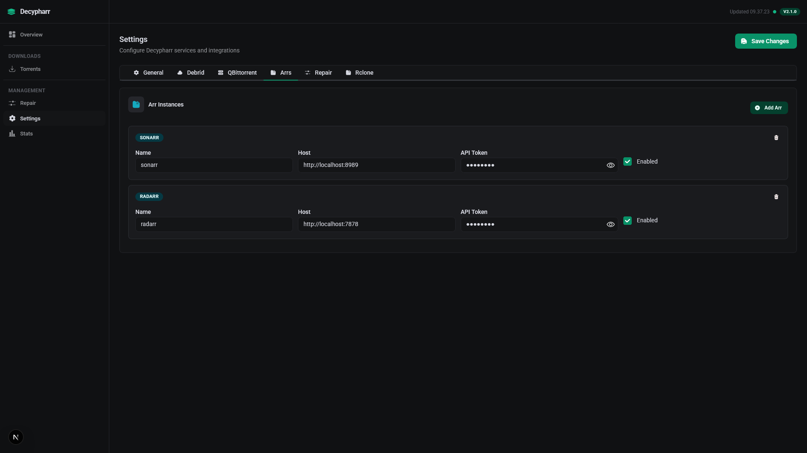
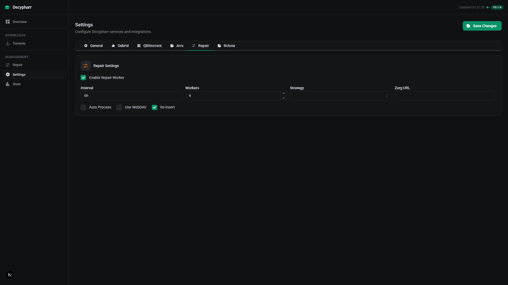
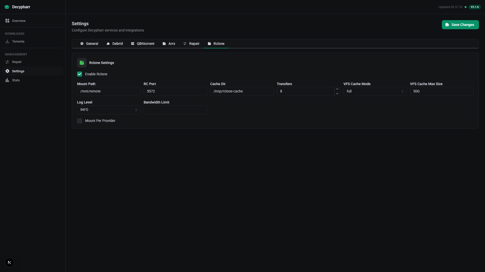

# Decypharr

**Decypharr** is an implementation of QBittorrent with **Multiple Debrid service support**, written in Go — with a modern React dashboard.

## What is Decypharr?

Decypharr combines the power of QBittorrent with popular Debrid services to enhance your media management. It provides a familiar interface for Sonarr, Radarr, and other \*Arr applications.

## Screenshots

| Dashboard | Downloads |
|:-:|:-:|
|  |  |

| Repair | Stats |
|:-:|:-:|
|  |  |

<details>
<summary>Settings tabs</summary>

| General | Debrid |
|:-:|:-:|
|  |  |

| QBittorrent | Arrs |
|:-:|:-:|
|  |  |

| Repair | Rclone |
|:-:|:-:|
|  |  |

</details>

## Features

- Mock QBittorrent API that supports the Arrs (Sonarr, Radarr, Lidarr etc)
- Modern React dashboard (Next.js + Mantine) with real-time torrent status
- Local cache — instantly downloads files from debrid to local storage after symlink creation
- Multiple Debrid provider support
- WebDAV server support for each debrid provider
- Optional mounting of WebDAV to your system (using [Rclone](https://rclone.org/))
- Repair Worker for missing files
- `.env` file support for easy configuration

## Supported Debrid Providers

- [Real Debrid](https://real-debrid.com)
- [Torbox](https://torbox.app)
- [Debrid Link](https://debrid-link.com)
- [All Debrid](https://alldebrid.com)

## Quick Start

### 1. Create your project folder

```bash
mkdir decypharr && cd decypharr
mkdir -p config
```

### 2. Create a `.env` file

```env
RD_API_KEY=your_real_debrid_api_key
LOCAL_CACHE_ENABLED=true
RCLONE_INDICATOR=decypharr/realdebrid
DOWNLOAD_FOLDER=/mnt/media
RCLONE_MOUNT_PATH=/mnt/remote
```

See [.env.example](.env.example) for all available options.

### 3. Create `docker-compose.yml`

```yaml
services:
  decypharr:
    image: ghcr.io/vecto3d/decypharr:latest
    container_name: decypharr
    ports:
      - "8282:8282"
    volumes:
      - ./config:/app
      - /mnt:/mnt:rshared
    devices:
      - /dev/fuse:/dev/fuse:rwm
    cap_add:
      - SYS_ADMIN
    env_file: .env
    restart: unless-stopped
```

### 4. Start

```bash
docker compose up -d
```

Open `http://localhost:8282` to access the dashboard.

### Without rclone/FUSE (Windows or direct download only)

```yaml
services:
  decypharr:
    image: ghcr.io/vecto3d/decypharr:latest
    container_name: decypharr
    ports:
      - "8282:8282"
    volumes:
      - ./config:/app
    env_file: .env
    restart: unless-stopped
```

## Configuration

### Environment Variables (.env)

| Variable | Description | Default |
|---|---|---|
| `RD_API_KEY` | Real-Debrid API key | - |
| `LOCAL_CACHE_ENABLED` | Copy files locally after symlink creation | `false` |
| `DOWNLOAD_FOLDER` | Where symlinks and local files are stored | Set in config.json |
| `RCLONE_MOUNT_PATH` | Where rclone mounts debrid files | Set in config.json |
| `RCLONE_INDICATOR` | Substring to identify rclone symlink targets | `decypharr` |
| `MAX_PARALLEL` | Max simultaneous file copies | `2` |
| `MIN_FREE_MB` | Stop caching below this free space (MB) | `20000` |
| `SCAN_INTERVAL` | Background scan interval in seconds | `1800` |

You can also configure Decypharr through the Web UI or by editing `config.json` directly in the `/app` volume.

## Documentation

For the upstream documentation, visit [sirrobot01/decypharr docs](https://sirrobot01.github.io/decypharr/).

## Development

### Frontend (Next.js)

```bash
cd frontend
npm install
npm run dev       # Dev server on :3000 (proxies API to :8282)
```

### Backend (Go)

```bash
go run . --config ./data
```

### Build Docker image locally

```bash
docker build -t decypharr .
```

## License

This project is licensed under the MIT License. See the [LICENSE](LICENSE) file for details.
